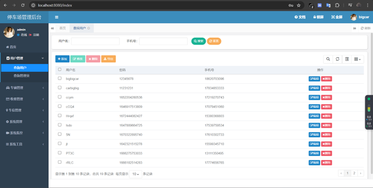

## 项目介绍

本项目是基于前后端不分离的若依框架进行了二次开发，同时也是我的毕业设计的一部分，关于若依框架部分的项目讲解请移步至（https://github.com/yangzongzhuan/RuoYi-fast）。

项目用到的识别模型（https://github.com/improveyour/Plate_detection_recognition）

小程序端也在这个项目中（等待完善）

停车场管理系统主要分为停车场管理系统web端和停车场管理系统微信小程序端。系统的web端主要面向拥有管理员权限的用户，可完成用户管理、车位管理、收费标准制定等操作；微信小程序端主要面向普通用户，可以查询自己的缴费记录，修改自己的个人信息。其中，车辆入库和车辆出库模块是本系统的重要组成部分，可以对进出停车场的车辆进行管理，系统整体框架如下：

数据库的ER图如下，具体的表结构详见项目中的 sql 文件夹中的 park_sql.sql 文件。

项目结构说明如下图：

## 内置功能

1. 用户管理：用户是系统操作者，该功能主要完成系统用户配置。
2. 部门管理：配置系统组织机构（公司、部门、小组），树结构展现支持数据权限。
3. 岗位管理：配置系统用户所属担任职务。
4. 菜单管理：配置系统菜单，操作权限，按钮权限标识等。
5. 角色管理：角色菜单权限分配、设置角色按机构进行数据范围权限划分。
6. 字典管理：对系统中经常使用的一些较为固定的数据进行维护。
7. 参数管理：对系统动态配置常用参数。
8. 通知公告：系统通知公告信息发布维护。
9. 操作日志：系统正常操作日志记录和查询；系统异常信息日志记录和查询。
10. 登录日志：系统登录日志记录查询包含登录异常。
11. 在线用户：当前系统中活跃用户状态监控。
12. 定时任务：在线（添加、修改、删除)任务调度包含执行结果日志。
13. 代码生成：前后端代码的生成（java、html、xml、sql）支持CRUD下载 。
14. 系统接口：根据业务代码自动生成相关的api接口文档。
15. 服务监控：监视当前系统CPU、内存、磁盘、堆栈等相关信息。
16. 缓存监控：对系统的缓存查询，删除、清空等操作。
17. 在线构建器：拖动表单元素生成相应的HTML代码。
18. 连接池监视：监视当前系统数据库连接池状态，可进行分析SQL找出系统性能瓶颈。

------

以上为若依框架自带的功能，以下为系统新增的功能：

1.车辆入库模块：上传车辆照片并调用识别模型，识别成功后返回识别结果

2.车辆出库模快：上传车辆照片并调用识别模型，识别成功后返回识别结果，根据识别结果进行计费

3.收费标准制定模块：允许管理员制定收费标准

4.出库缴费模块：用户可以在微信小程序扫描生成的支付二维码进行缴费

## 快速部署

1.拉取项目到本地并进行解压

2.修改项目的maven为自己的maven

3.修改 **park/src/main/java/com/ruoyi/plateRec/service/impl/FileService.java**  中第 24 行的绝对路径为项目文件夹中的
plate_img 文件夹，如下图：

仅需要修改红色框中的路径即可

4.修改 **ruoyi-admin/src/main/java/com/ruoyi/web/controller/park/ParkingController.java** 中第 270
行中的绝对路径，该路径为支付二维码生成的路径，可以自定义存放位置

4.启动前检查自己的8080端口和8000端口是否被占用，如果被占用了，可以修改*
*park/src/main/java/com/ruoyi/plateRec/service/impl/FileService.java**  中的第 90 和 165 行的 url 地址的端口，同时还要修改识别模型中的
**java_demo_plus.py** 文件中第 303 行的端口

5.执行模型中的 **java_demo_plus.py** 文件

6.执行 **RuoYiApplication.java** ，该文件的路径为：ruoyi-admin/src/main/java/com/ruoyi/RuoYiApplication.java

（如需要该毕设配套的毕业论文，可联系QQ有偿获取：1677830702）

## 演示图

用户登录：

用户管理：

用户新增：

车辆入库：

车辆出库（不需要付款）：

车辆出库（需要付款）：

收费标准制定：

## 注意事项

1.项目中的 ECharts 图并未调用数据库，属于未完成版，后期会改（下次一定）

2.若依框架自带的代码生成器特别好用，可以搜一下相关的使用教程

3.小程序端代码也在该项目目录中，除了支付功能，其余功能均为完善好，有时间的话会对其进行更新（以后一定），小程序向后端发送 GET
请求时，IP地址已经被写死了，需要使用 ipconfig 来查询并修改为本机的 IP 地址